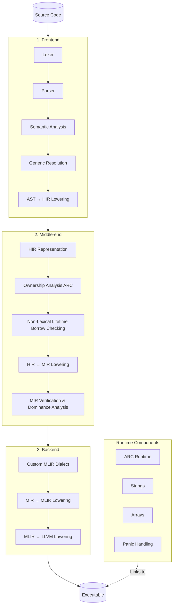

<p align="left">
  
</p>

# Moksha

<p align="left">
  <a href="https://discord.com/channels/1510845258605527151/1510845260547227791">
    
  </a>
  <a href="https://youtube.com/@mokshaprogramminglanguage?si=qzSkAgmgsRRNs-jA">
    
  </a>
  <a href="https://moksha-lang-web.onrender.com/">
    
  </a>
</p>

Moksha is a statically typed systems programming language with a custom multi-stage compilation pipeline, aimed to bridge performance with flexibility and safety.

<p align="left">
  <a href="https://github.com/Swarup-Moulik/Moksha/stargazers">
    
  </a>
  <a href="https://github.com/Swarup-Moulik/Moksha/network/members">
    
  </a>
  
  <a href="https://github.com/Swarup-Moulik/Moksha/blob/main/LICENSE">
    
  </a>
</p>

---

> **⚠️ Disclaimer: Active Development**
> Moksha is currently in an early, active stage of development. While the core compilation pipeline is functional, features are subject to change, and you may encounter bugs or incomplete implementations.

> **⚠️ Platform Support Warning**
> Moksha has **only been tested on Windows 10 and Kali Linux**. Other platforms (macOS, Android, iOS, WebAssembly, bare-metal) are targeted by the backend, but may not work reliably and have not been validated. Build and run at your own risk on untested platforms.

## Core Features

- **Deterministic Memory Management:** Zero-cost abstractions with no Garbage Collector. Moksha utilizes Automatic Reference Counting (ARC) paired with strict Non-Lexical Lifetime (NLL) borrow checking to ensure memory safety at compile time.
- **Modern Multi-Stage Backend:** Powered by a custom MLIR dialect and the LLVM 22 infrastructure, delivering aggressive optimization passes and highly efficient machine code.
- **Built-in Fixed-Point Decimals:** First-class support for fixed-point arithmetic, guaranteeing exact precision for financial calculations and avoiding standard floating-point rounding errors.
- **Seamless C-FFI:** Native, overhead-free interoperability with existing C/C++ libraries. You can link and call external functions directly using `unsafe` blocks.
- **Write Once, Compile Anywhere:** First-class cross-compilation support for Linux, Windows, macOS, Android, iOS, and WebAssembly (WASI & Browser) straight out of the box.
- **Bare-Metal Ready:** Features a modular, lightweight runtime library (`libmoksha_rt`) designed to run in freestanding environments without OS dependencies.

## Code Example

Here is a quick look at Moksha's safe borrowing and reference mechanisms:

```moksha
    int data = 10;
    *mut int m1 = &data;

    // Reborrow from the reference itself
    *view int v = &*m1;

    int read = *v;
    println(read); // Expected: 10

    // 'v' dies here, releasing the view borrow.

    *m1 = 20; // Safe to use m1 again!
    println(data); // Expected: 20
```

---

# Architecture



---

# Setup & Installation

To build and run Moksha, you need the MSYS2 MinGW64 environment.

---

## 1. Prerequisites

**For Linux (Debian/Ubuntu):**
Run the included setup script:
`sudo ./install_linux.sh`

**For Windows (MSYS2):**
Run the included `install_windows.sh` script, or install manually:

Open your MSYS2 MinGW 64-bit terminal and install the necessary toolchain:

```bash
# Update package database
pacman -Syu

# Install GCC, Clang, LLVM, MLIR, CMake, and Ninja
pacman -S --needed mingw-w64-x86_64-toolchain \
  mingw-w64-x86_64-llvm \
  mingw-w64-x86_64-mlir \
  mingw-w64-x86_64-cmake \
  mingw-w64-x86_64-ninja
```

---

## 2. Configure Environment Path

To run `mokshac` from terminal of any IDE, add the Moksha binary directory to your `PATH` of msys2 mingw64 terminal.

### Create the destination directory

```bash
mkdir -p /c/Moksha/bin /c/Moksha/runtime
```

### Open your bash configuration

```bash
nano ~/.bashrc
```

### Add the following line to the end of the file

```bash
export PATH="$PATH:/c/Moksha/bin"
```

### Apply the changes

```bash
source ~/.bashrc
```

---

## 3. Build & Install

Build the compiler from scratch and copy the artifacts to your path:

```bash
# Configure and Build
cmake -B build -G Ninja
cmake --build build

# Install to system path
cp build/tools/mokshac.exe /c/Moksha/bin/
cp build/tools/moksha-opt.exe /c/Moksha/bin/
cp build/runtime/libmoksha_rt_windows.a /c/Moksha/runtime/
```

---

## 4. Verify Installation

Open a new terminal and verify the installation:

```bash
which mokshac
```

Expected output:

```bash
/c/Moksha/bin/mokshac.exe
```

---

# Usage

Compile a Moksha source file:

```bash
mokshac array_builtins.mox -o array_builtins
./array_builtins
```

---

# Cross Compilation Targets

Moksha supports LLVM target triples for cross-platform compilation.

Example:

```bash
mokshac cross_compile.mox -target x86_64-pc-linux-gnu -o cross_compile_linux
```

## Supported Target Flags

| Platform              | Target Flag                      |
| --------------------- | -------------------------------- |
| Linux (x86_64)        | `-target x86_64-pc-linux-gnu`    |
| Android (ARM64)       | `-target aarch64-linux-android`  |
| macOS (Apple Silicon) | `-target arm64-apple-darwin`     |
| iOS (ARM64)           | `-target aarch64-apple-ios`      |
| Windows (MSVC x86_64) | `-target x86_64-pc-windows-msvc` |
| WebAssembly WASI      | `-target wasm32-wasi`            |
| WebAssembly Browser   | `-target wasm32-unknown-unknown` |

## Example Commands

```bash
# Linux
mokshac cross_compile.mox -target x86_64-pc-linux-gnu -o cross_compile_linux

# Android
mokshac cross_compile.mox -target aarch64-linux-android -o cross_compile_android

# macOS
mokshac cross_compile.mox -target arm64-apple-darwin -o cross_compile_mac

# iOS
mokshac cross_compile.mox -target aarch64-apple-ios -o cross_compile_ios

# Windows
mokshac cross_compile.mox -target x86_64-pc-windows-msvc -o cross_compile_windows

# WASI
mokshac cross_compile.mox -target wasm32-wasi -o cross_compile_wasm.wasm

# Browser WebAssembly
mokshac cross_compile.mox -target wasm32-unknown-unknown -o index.html
```

## License

Moksha is distributed under the MIT License. See `LICENSE` for more information.
